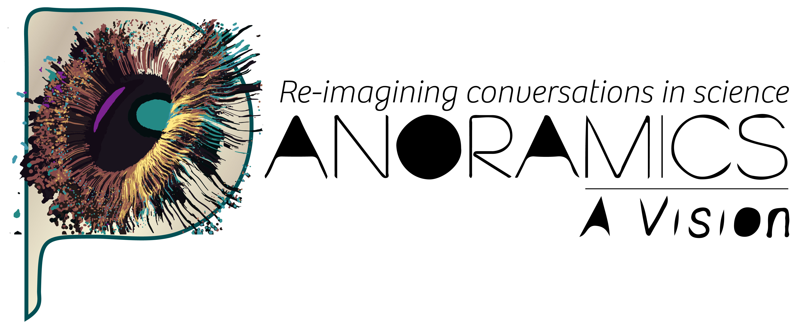

# spatioscript-llm-spatial-biology

SpatioScript: LLM-powered spatial biology query model

[](LICENSE)

<!-- PROJECT LOGO -->
<br />
<div align="center">
  <a href="https://github.com/agkirici/spatioscript-llm-spatial-biology">
    
  </a>

  <h3 align="center">SpatioScript: LLM-Powered Spatial Biology</h3>

  <p align="center">
    Bioinformatics project developed for the Toronto Hackathon
    <br />
    <a href="https://github.com/agkirici/spatioscript-llm-spatial-biology"><strong>Explore the docs »</strong></a>
    <br />
    <br />
    <a href="https://github.com/agkirici/spatioscript-llm-spatial-biology">View Demo</a>
    &middot;
    <a href="https://github.com/agkirici/spatioscript-llm-spatial-biology/issues/new?labels=bug&template=bug-report---.md">Report Bug</a>
    &middot;
    <a href="https://github.com/agkirici/spatioscript-llm-spatial-biology/issues/new?labels=enhancement&template=feature-request---.md">Request Feature</a>
  </p>
</div>

## Let's get started

We are excited to share that Panoramics-a-Vision proudly took part in the recent hackathon! Panoramics is a pan-Canadian catalyst for spatial biology and single-cell innovation, bringing together science, technology, and visionary impact.

Our hackathon team combined diverse expertise and strong collaboration:

Shamini Ayyadhury – CEO of Panoramics and our team leader, providing vision and direction.
Suluxan Mohanraj – Software Developer and co-team leader, driving our technical development.
Arzu Kirici – Computational Scientist, contributing analytical depth and problem-solving.
Alyona Ivanova – Scientist, Creative Content Maestro
Kasra Rahimian – Web Developer, ensuring seamless design and implementation on the web side.
Together, we worked across disciplines to turn ideas into solutions, demonstrating the collaborative spirit that defines Panoramics.


## Abstract

Single-cell RNA sequencing (scRNA-seq) has enabled the measurement of expression levels of thousands of genes across millions of individual cells. While scRNA-seq provides deep transcriptional profiles, it obscures critical information about each cell’s physical location within the tissue microenvironment. Spatial transcriptomics overcomes this limitation by mapping gene expression back onto tissue sections, offering a powerful view of both the molecular identity of cells and their spatial organization. Together, these technologies allow researchers to study how cells are organized and interactions within complex biological systems, such as tumours.
We present an interactive AI-powered application that enables natural language interrogation of spatial transcriptomics data, with a focus on the tumour microenvironment, where the physical arrangement of immune cells, stromal components, and malignant cells plays a critical role in disease progression and therapeutic response. Users can upload or select pre-processed public datasets and ask questions of their data such as “Are CD8+ T cells enriched in the tumour core?” or “Return the spatial proximity of CD8 cells next to blood vessels” or “How correlated are my spatial domains with pathology annotations?”. 
The system integrates preprocessed public spatial datasets with cell type annotations and a spatial graph (i.e. connectivity map), performs relevant neighbourhood and enrichment analyses, and generates concise, biologically contextualized summaries using a large language model (LLM). 
With an ultimate goal of enhancing multi-disciplinary research, our tool 1) lowers the barrier to explore high-dimensional spatial datasets and 2) facilitates integration of image-based annotations with high-dimensional molecular discoveries, serving as a valuable toolkit for biologists and clinicians. This project demonstrates how natural language interfaces can make complex high-dimensional omics data more accessible and actionable, augmenting biological insights and empowering the user’s scientific vision.

### Built With


* [![Python][Python.org]][Python-url]
* [![OpenAI][OpenAI.com]][OpenAI-url]
* [![FastAPI][FastAPI.tiangolo]][FastAPI-url]
* [![Docker][Docker.com]][Docker-url]
* [![Neo4j][Neo4j.com]][Neo4j-url]

<p align="right">(<a href="#readme-top">back to top</a>)</p>

## Installation

Provide instructions on how to install and set up the project, such as installing dependencies and preparing the environment.

```bash
# Example command to install dependencies (Python)
pip install project-dependencies

# Example command to install dependencies (R)
install.packages("project-dependencies")
```


## Quick Start

Provide a basic usage example or minimal code snippet that demonstrates how to use the project.

```python
# Example usage (Python)
import my_project

demo = my_project.example_function()
print(demo)
```
```r
# Example usage (R)
library(my_project)

demo <- example_function()
print(demo)
```

## Usage

Add detailed information and examples on how to use the project, covering its major features and functions.

```python
# More usage examples (Python)
import my_project

demo = my_project.advanced_function(parameter1='value1')
print(demo)
```
```r
# More usage examples (R)
library(demoProject)

demo <- advanced_function(parameter1 = "value1")
print(demo)
```

## Contribute

Contributions are welcome! If you'd like to contribute, please open an issue or submit a pull request. See the [contribution guidelines](CONTRIBUTING.md) for more information.

## Support

<!-- CONTACT -->
## Contact

Panoramics-A-vision - [@your_linkedIn](https://www.linkedin.com/company/panoramics-a-vision/posts/?feedView=all)


<p align="right">(<a href="#readme-top">back to top</a>)</p>


<!-- MARKDOWN LINKS & IMAGES -->
[Python.org]: https://img.shields.io/badge/Python-3776AB?style=for-the-badge&logo=python&logoColor=white
[Python-url]: https://www.python.org/

[OpenAI.com]: https://img.shields.io/badge/OpenAI-412991?style=for-the-badge&logo=openai&logoColor=white
[OpenAI-url]: https://openai.com/

[FastAPI.tiangolo]: https://img.shields.io/badge/FastAPI-009688?style=for-the-badge&logo=fastapi&logoColor=white
[FastAPI-url]: https://fastapi.tiangolo.com/

[Docker.com]: https://img.shields.io/badge/Docker-2496ED?style=for-the-badge&logo=docker&logoColor=white
[Docker-url]: https://www.docker.com/

[Neo4j.com]: https://img.shields.io/badge/Neo4j-008CC1?style=for-the-badge&logo=neo4j&logoColor=white
[Neo4j-url]: https://neo4j.com/
If you have any issues or need help, please open an [issue](https://github.com/hackbio-ca/demo-project/issues) or contact the project maintainers.

## License

This project is licensed under the [MIT License](LICENSE).
